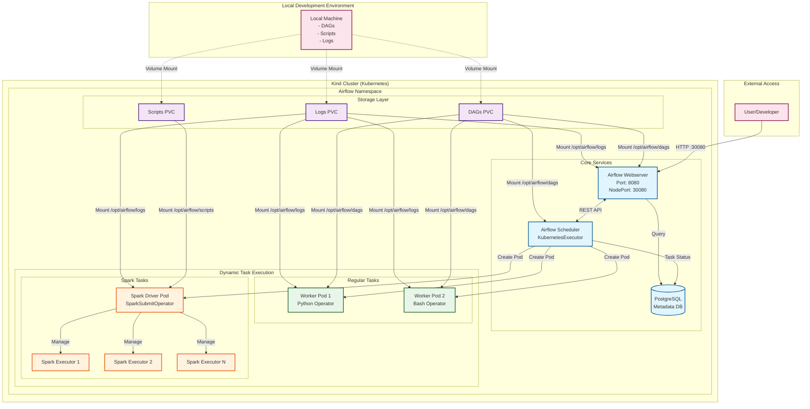

# Airflow + PySpark on Kubernetes

[](https://airflow.apache.org/) [](https://kubernetes.io/) [](https://spark.apache.org/) [](https://helm.sh/)

A production-ready infrastructure setup for running Apache Airflow with PySpark on Kubernetes using Helm charts and Kind for local development.

## Features

- **Apache Airflow** with KubernetesExecutor for dynamic pod scaling
- **PySpark** integration for distributed big-data processing
- **PostgreSQL** as the metadata database
- **Helm** charts for repeatable, configurable deployments
- **Kind** (Kubernetes in Docker) for local development
- **Sample DAGs** demonstrating ETL workflows
- **RBAC** configured for secure Kubernetes operations
- **Persistent volumes** for DAGs, logs, and plugins

## Table of Contents

- [Architecture](#architecture)
- [Prerequisites](#prerequisites)
- [Quick Start](#quick-start)
- [Port Configuration](#port-configuration)
- [Accessing Airflow UI](#accessing-airflow-ui)
- [DAGs & Examples](#dags--examples)
- [Development Workflow](#development-workflow)
- [Configuration](#configuration)
- [Troubleshooting](#troubleshooting)
- [License](#license)

## Architecture



## Repository Structure

```
.
├── dags/                          # Airflow DAG definitions
│   ├── hello_world_dag.py         # Basic example DAG
│   ├── one_task_dag.py            # Single task example
│   ├── spark_wordcount.py         # PySpark integration example
│   └── test_kubernetes_executor.py # Kubernetes executor test
├── k8s/                           # Kubernetes manifests
│   └── rbac.yaml                  # RBAC permissions
├── scripts/                       # PySpark applications and data
│   ├── sample_text.txt            # Sample data for wordcount
│   └── wordcount.py               # PySpark wordcount script
├── templates/                     # Helm chart templates
│   ├── airflow-configmap.yaml
│   ├── airflow-init-job.yaml
│   ├── airflow-scheduler-deployment.yaml
│   ├── airflow-webserver-deployment.yaml
│   ├── airflow-webserver-service.yaml
│   ├── postgresql-deployment.yaml
│   ├── postgresql-pvc.yaml
│   ├── postgresql-service.yaml
│   └── worker-pod-template-configmap.yaml
├── .gitignore
├── .helmignore
├── Chart.yaml                     # Helm chart metadata
├── README.md                      # This file
├── kind-config.yaml               # Kind cluster configuration
└── values.yaml                    # Helm value overrides
```

## Prerequisites

### Required Tools

| Tool    | Version | Installation Guide                                           |
| ------- | ------- | ------------------------------------------------------------ |
| Docker  | 20.10+  | [Install Docker Desktop](https://www.docker.com/products/docker-desktop) |
| Kind    | 0.11+   | [Install Kind](https://kind.sigs.k8s.io/docs/user/quick-start/) |
| kubectl | 1.21+   | [Install kubectl](https://kubernetes.io/docs/tasks/tools/)   |
| Helm    | 3.0+    | [Install Helm](https://helm.sh/docs/intro/install/)          |
| Git     | 2.0+    | [Install Git](https://git-scm.com/downloads)                 |


### Verify Installation

```bash
# Check all tools are installed
docker --version
kind --version
kubectl version --client
helm version
git --version
```
---
### NOTE
#### Additional Development Tools

For a complete development environment, you may also want to install:
- **Python 3.8+** - Required for local DAG development and testing
- **Visual Studio Code** - Recommended IDE with excellent Python and Kubernetes support

#### Installation Resources
**Comprehensive setup guides available at:** [DataTweets Documentation](https://datatweets.com/docs/reference/)

The documentation includes step-by-step instructions for:
- Python installation across different operating systems
- Visual Studio Code setup and configuration

---

## Quick Start

### 1. Clone the Repository

```bash
git clone https://github.com/datatweets/airflow-pyspark-k8s.git
cd airflow-pyspark-k8s
```

### 2. Configure Host Paths

Update the paths in two files to match your local environment:

**In `values.yaml`:**

```yaml
volumes:
  hostPaths:
    dags:     /Users/YOUR_USERNAME/airflow-pyspark-k8s/dags
    scripts:  /Users/YOUR_USERNAME/airflow-pyspark-k8s/scripts
    logs:     /Users/YOUR_USERNAME/airflow-pyspark-k8s/logs
    plugins:  /Users/YOUR_USERNAME/airflow-pyspark-k8s/plugins
```

**In `kind-config.yaml`:**

```yaml
nodes:
  - role: control-plane
    extraMounts:
      - hostPath: /Users/YOUR_USERNAME/airflow-pyspark-k8s
        containerPath: /workspace
```

### 3. Set Java Home

In `templates/airflow-configmap.yaml`, set the appropriate JAVA_HOME:

**For Intel/AMD (x86_64):**

```yaml
data:
  JAVA_HOME: "/usr/lib/jvm/java-17-openjdk-amd64"
```

**For ARM (Apple Silicon):**

```yaml
data:
  JAVA_HOME: "/usr/lib/jvm/java-17-openjdk-arm64"
```

### 4. Create the Kind Cluster

```bash
kind create cluster --name airflow-cluster --config kind-config.yaml
```

### 5. Apply RBAC Configuration

The RBAC manifest creates the `airflow-worker` and `airflow-scheduler`
service accounts in a namespace you specify. Set the `NAMESPACE`
environment variable and substitute it into the manifest before
applying:

```bash
NAMESPACE=default
envsubst < k8s/rbac.yaml | kubectl apply -f -
```

### 6. Deploy with Helm

```bash
helm upgrade --install airflow-pyspark . \
  --namespace "$NAMESPACE" \
  --create-namespace \
  --values values.yaml \
  --wait
```

### 7. Verify Deployment

```bash
# Check all pods are running
kubectl get pods -n "$NAMESPACE"

# Check services
kubectl get svc -n "$NAMESPACE"

# Watch pod status in real-time
kubectl get pods -n "$NAMESPACE" -w
```

## Port Configuration

### Default Port Binding (NodePort 30080)

By default, the Airflow webserver is exposed via NodePort on port 30080:

```yaml
# In templates/airflow-webserver-service.yaml
service:
  type: NodePort
  port: 8080
  nodePort: 30080
```

Access URL: `http://localhost:30080`

### Alternative: Port 8080 Binding

To bind directly to port 8080 on your local machine, you have two options:

#### Option 1: Port Forwarding (Recommended)

```bash
# Forward local port 8080 to the Airflow webserver
kubectl port-forward svc/airflow-webserver 8080:8080 -n "$NAMESPACE"
```

Access URL: `http://localhost:8080`

#### Option 2: Modify Kind Configuration

Add port mapping to `kind-config.yaml`:

```yaml
kind: Cluster
apiVersion: kind.x-k8s.io/v1alpha4
nodes:
  - role: control-plane
    extraPortMappings:
      - containerPort: 30080
        hostPort: 8080
        protocol: TCP
    extraMounts:
      - hostPath: /Users/YOUR_USERNAME/airflow-pyspark-k8s
        containerPath: /workspace
```

Then recreate the cluster:

```bash
kind delete cluster --name airflow-cluster
kind create cluster --name airflow-cluster --config kind-config.yaml
```

## Accessing Airflow UI

### Default Credentials

- **URL:** `http://localhost:30080` (or `http://localhost:8080` if using port forwarding)
- **Username:** `admin`
- **Password:** `admin`

### First Login

1. Navigate to the Airflow UI
2. Login with default credentials
3. You should see the DAGs view with sample DAGs
4. Toggle DAGs on/off using the switch

## DAGs & Examples

### Included DAGs

| DAG                         | Description                      | Key Features                                |
| --------------------------- | -------------------------------- | ------------------------------------------- |
| `hello_world_dag`           | Basic workflow example           | Python & Bash operators, task dependencies  |
| `one_task_dag`              | Minimal single task example      | Simple Python operator                      |
| `spark_wordcount`           | PySpark integration demo         | SparkSubmitOperator, distributed processing |
| `test_kubernetes_executor`  | Kubernetes executor validation   | Tests dynamic pod creation                  |

### Creating New DAGs

1. Create a new Python file in the `dags/` directory
2. Define your DAG using Airflow's decorators or context managers
3. Save the file - Airflow will auto-detect it within 30 seconds

Example DAG structure:

```python
from airflow import DAG
from airflow.operators.python import PythonOperator
from datetime import datetime, timedelta

default_args = {
    'owner': 'data-team',
    'retries': 1,
    'retry_delay': timedelta(minutes=5),
}

with DAG(
    'my_new_dag',
    default_args=default_args,
    description='My custom DAG',
    schedule_interval='@daily',
    start_date=datetime(2024, 1, 1),
    catchup=False,
) as dag:
    
    def my_task():
        print("Hello from my task!")
    
    task = PythonOperator(
        task_id='my_task',
        python_callable=my_task,
    )
```

## Development Workflow

### Hot Reloading

Changes to the following directories are reflected immediately:

- `dags/` - New DAGs appear in UI within 30 seconds
- `scripts/` - Updated scripts used on next task run
- `plugins/` - Custom operators/hooks available after scheduler restart

### Testing DAGs Locally

```bash
# Test DAG loading
kubectl exec -it deployment/airflow-scheduler -n "$NAMESPACE" -- airflow dags list

# Test specific DAG
kubectl exec -it deployment/airflow-scheduler -n "$NAMESPACE" -- airflow dags test <dag_id> <date>

# Trigger DAG manually
kubectl exec -it deployment/airflow-scheduler -n "$NAMESPACE" -- airflow dags trigger <dag_id>
```

### Viewing Logs

```bash
# Scheduler logs
kubectl logs deployment/airflow-scheduler -n "$NAMESPACE" -f

# Webserver logs
kubectl logs deployment/airflow-webserver -n "$NAMESPACE" -f

# Task logs (available in UI or in logs/ directory)
tail -f logs/dag_id=<dag_id>/run_id=<run_id>/task_id=<task_id>/attempt=1.log
```

## Configuration

### Key Configuration Files

| File                                    | Purpose              | Key Settings                                 |
| --------------------------------------- | -------------------- | -------------------------------------------- |
| `values.yaml`                           | Helm value overrides | Host paths, resource limits, executor config |
| `Chart.yaml`                            | Helm chart metadata  | Version, dependencies, app info              |
| `kind-config.yaml`                      | Kind cluster setup   | Port mappings, volume mounts                 |
| `templates/airflow-configmap.yaml`      | Airflow environment  | JAVA_HOME, Python paths                      |

### Common Customizations

#### Increase Resources

In `values.yaml`:

```yaml
scheduler:
  resources:
    requests:
      memory: "1Gi"
      cpu: "500m"
    limits:
      memory: "2Gi"
      cpu: "1000m"
```

#### Add Python Dependencies

Create a custom Dockerfile:

```dockerfile
FROM apache/airflow:2.7.0
USER airflow
COPY requirements.txt /
RUN pip install --no-cache-dir -r /requirements.txt
```

#### Configure Spark Resources

In your DAG:

```python
spark_config = {
    "spark.executor.memory": "2g",
    "spark.executor.cores": "2",
    "spark.executor.instances": "3",
}
```

## Troubleshooting

### Common Issues and Solutions

#### Pod Stuck in Pending/CrashLoopBackOff

```bash
# Describe pod for events
kubectl describe pod <pod-name> -n "$NAMESPACE"

# Check logs
kubectl logs <pod-name> -n "$NAMESPACE" --previous

# Common fixes:
# - Check resource availability: kubectl top nodes
# - Verify volume mounts exist
# - Check RBAC permissions
```

#### Volume Mount Failures

```bash
# Verify paths exist on host
ls -la /Users/YOUR_USERNAME/airflow-pyspark-k8s/

# Check Kind node mounts
docker exec -it airflow-cluster-control-plane ls -la /workspace/

# Ensure proper permissions
chmod -R 755 dags/ scripts/ logs/ plugins/
```

#### Spark Job Failures

```bash
# Find Spark driver pod
kubectl get pods -n "$NAMESPACE" | grep spark-

# Check driver logs
kubectl logs <spark-driver-pod> -n "$NAMESPACE"

# Common issues:
# - JAVA_HOME not set correctly
# - Insufficient memory for executors
# - PySpark version mismatch
```

#### Database Connection Issues

```bash
# Check PostgreSQL pod
kubectl logs deployment/postgres -n "$NAMESPACE"

# Test connection
kubectl exec -it deployment/airflow-scheduler -n "$NAMESPACE" -- airflow db check
```

### Debug Commands Cheatsheet

```bash
# Get all resources in the namespace
kubectl get all -n "$NAMESPACE"

# Describe deployments
kubectl describe deployment -n "$NAMESPACE"

# Execute commands in scheduler
kubectl exec -it deployment/airflow-scheduler -n "$NAMESPACE" -- bash

# Check Airflow configuration
kubectl exec -it deployment/airflow-scheduler -n "$NAMESPACE" -- airflow config list

# Force restart deployments
kubectl rollout restart deployment -n "$NAMESPACE"
```

## Production Considerations

### Security

- [ ] Change default passwords
- [ ] Enable RBAC in Airflow
- [ ] Use secrets management (Kubernetes Secrets, HashiCorp Vault)
- [ ] Configure network policies
- [ ] Enable TLS/SSL

### Scalability

- [ ] Use external PostgreSQL (RDS, Cloud SQL)
- [ ] Configure autoscaling for workers
- [ ] Use distributed storage (S3, GCS) for logs
- [ ] Implement resource quotas

### Monitoring

- [ ] Deploy Prometheus & Grafana
- [ ] Configure Airflow metrics export
- [ ] Set up log aggregation (ELK, Fluentd)
- [ ] Create alerting rules

### High Availability

- [ ] Multiple scheduler replicas (Airflow 2.0+)
- [ ] Database replication
- [ ] Multi-zone node pools
- [ ] Backup strategies

## License

This project is licensed under the MIT License - see the [LICENSE](LICENSE) file for details.

------

**Ready to orchestrate your data pipelines?** Star this repo and start building!

For questions and support, please open an [issue](https://github.com/datatweets/airflow-pyspark-k8s/issues) or join our [discussions](https://github.com/datatweets/airflow-pyspark-k8s/discussions).