# Introduction to Data Orchestration
##### Mohammad Mehdi Lotfinejad
## 1. What Is Data Orchestration?

Imagine you are a data engineer at a fast-growing startup. Every day, your systems collect information from multiple places: customer sign-ups from a website form, sales records from a point-of-sale system, clickstream events from your mobile app, and marketing data from a third-party API. All this data must flow into a central location (like a data warehouse) where analysts and data scientists can run queries and build dashboards.

If you tried to manually move each data file, run scripts to clean it up, and execute SQL loads, you’d quickly be overwhelmed. Mistakes slip in, dependencies get messed up, and your “data pipeline” becomes brittle. **Data orchestration** solves this problem by automating and coordinating every step—from extraction to transformation to loading—so your team can focus on analysis, not on babysitting scripts.

------

### 1.1 Definition of Data Orchestration

- **Orchestration as Coordination:**
   At its core, data orchestration is like a conductor leading an orchestra. Instead of musicians playing notes, your “musicians” are individual data tasks (e.g., extract data, transform data, load data). The conductor ensures each musician plays at the right moment and in harmony with the others. Similarly, a data orchestrator (a specialized software tool) runs each step of your data pipeline in the correct order.
- **Directed Acyclic Graph (DAG):**
   Most orchestrators let you define your pipeline as a Directed Acyclic Graph—abbreviated “DAG.” In a DAG, each node represents one task (for example, “fetch weather data”), and each directed edge shows the dependency (“don’t transform until you’ve fetched”). Because there are no cycles, you never get stuck waiting on a task that depends on itself.
- **Automation of Scheduling:**
   Rather than manually run “python extract.py” every day, orchestration tools let you specify a schedule (say, daily at 2:00 AM). The orchestrator wakes up, sees that your DAG is due, and enqueues tasks in the proper order. If one task fails, it can retry automatically or send an alert to your team.
- **Monitoring & Observability:**
   As tasks execute, the orchestrator tracks their state (“running,” “success,” or “failed”) in a central database. You can look at a web-based dashboard to see which tasks have passed and which have broken. If something goes wrong, you immediately know where to look.

------

### 1.2 Why Data Orchestration Matters

1. **Eliminates Manual Overhead:**
    Without orchestration, you might write a long shell script or several Python scripts that you have to run by hand. That can be fine for small projects, but barely tolerable once you have multiple daily jobs. Orchestration tools remove the need to press “run” or “schedule” by hand.
2. **Enforces Dependency Order:**
    In a weather dashboard example (Section 1.4), you cannot “clean” data before “fetching” it. With manual scripts, someone might forget to run the fetch step, causing the clean step to fail. An orchestrator looks at your DAG and forces tasks to run only when all upstream tasks have succeeded.
3. **Speeds up Development and Scaling:**
    When your pipeline grows from 3 tasks to 30 tasks, and when different branches of your DAG can run in parallel (for instance, cleaning historical data while still ingesting new data), orchestration allows those branches to execute concurrently. You no longer need one big script that runs everything in sequence.
4. **Provides Observability and Alerting:**
    Suppose a nightly job fails because an API changed its format. An orchestrator logs the failure and—if configured—sends an email or Slack alert. You see an error in the dashboard, click into the failed task, inspect its logs, fix the code, and restart only that task. No more guessing which part of a monolithic script blew up.
5. **Centralizes Governance and Auditing:**
    By having all DAG definitions in version control and execution history in a centralized metadata store, you gain a reliable audit trail. If your organization must prove compliance (e.g., “show me the code and run logs for last month’s data load”), you can show who ran what, when, and with which parameters.

**Bottom line:** Data orchestration turns a complex tangle of scripts and command-line invocations into a clean, reliable, and highly visible workflow.

------

### 1.3 How Orchestration Fits into the Data Ecosystem

In a typical data stack, you have:

- **Data Sources:**
  - User interactions (web clicks, mobile events)
  - Transactional systems (sales logs, CRM, ERP)
  - External APIs (weather, stock prices)
  - Logs, files, and streaming data
- **Compute Engines:**
  - Spark clusters for large-scale transformations
  - Custom Python or SQL scripts for cleaning and aggregation
  - Machine learning models that take prepared data and produce predictions
- **Storages:**
  - Data lakes (e.g., Amazon S3, HDFS)
  - Data warehouses (e.g., Snowflake, BigQuery)
  - NoSQL stores (e.g., Cassandra, DynamoDB)

Without orchestration, you would need to write code in each compute engine (Spark job, Python script, SQL query) and chain them manually: “First run this Python script, then trigger the Spark job, then load the results into the warehouse.” As data volumes and logic complexity grow, manually coordinating this becomes error-prone.

**Data orchestration sits one layer above:** it does not transform data itself, but it calls each of those compute engines in the correct order, with retries, logs, and notifications. It “glues” the entire stack together.

------

### 1.4 Example: Simple Weather Dashboard Pipeline

Let’s put the abstract ideas into a concrete example.

**Use Case:** You want to build a simple seven-day weather forecast dashboard for a website.

**Required Steps:**

1. **Fetch Weather Data (Task A):** Call a public weather API (e.g., OpenWeatherMap) and store the raw JSON in cloud storage or a local file.
2. **Clean & Transform (Task B):** Read the raw JSON, convert temperature units, filter out unneeded fields, and write a cleaned CSV or Parquet file.
3. **Load into Database (Task C):** Load the cleaned data into a database table that powers your dashboard queries.

**Why Orchestrate?**

- **Order Matters:** You cannot run “Clean & Transform” (Task B) if “Fetch” (Task A) has not finished or has failed. The orchestrator sees that Task B depends on Task A.
- **Retry Logic:** If Task A fails because the API timed out, the orchestrator can automatically retry three times with a 10-minute delay. If all retries fail, it sends an alert.
- **Parallel Branches (Extension):** Suppose you also add a pipeline to fetch historical weather data. That pipeline is independent of the daily fetch for tomorrow’s forecast. The orchestrator can run them in parallel.
- **Visibility:** You open the orchestration dashboard, see a graph: A → B → C. If B is red (failed), you click, examine logs (maybe a JSON parsing error), fix the code, and re-run only Task B and Task C. You do not need to re-fetch the API data from Task A.

**Visualizing as a DAG:**

```mermaid
graph LR
    A[📊 Fetch Weather Data <br> <b>Task A</b>]
    B[🔧 Clean/Transform <br> <b>Task B</b>]
    C[💾 Load into DB <br> <b>Task C</b>]
    
    A -->|Raw Data| B
    B -->|Processed Data| C
    
    style A fill:#e1f5fe,stroke:#01579b,stroke-width:3px
    style B fill:#fff3e0,stroke:#ff6f00,stroke-width:3px
    style C fill:#e8f5e9,stroke:#2e7d32,stroke-width:3px
```




- A has no upstream dependencies.
- B depends on A.
- C depends on B.

After Task A succeeds at 2 AM every day, Task B starts automatically. When Task B finishes, Task C loads the data, and your dashboard updates with the latest weather. All of this happens without you manually SSH'ing into servers at 2 AM.

------

### 1.5 Data Orchestration vs. Sequential Scripting

**Sequential Scripts (The Quick-and-Dirty Approach):**

- You write a single shell script or Python script that does:
  1. Fetch data from the API
  2. Transform the data
  3. Upload to the database
- You set up a cron job at 2 AM to run `bash run_weather_pipeline.sh`.
- **Drawbacks:**
  - If the transform step fails at step 2, you still need to re-run from step 1, re-fetching data.
  - No automatic retries; a cron failure might go unnoticed until the dashboard breaks.
  - Hard to add new parallel branches (e.g., historical fetch).
  - No centralized logs—everything lives in different scripts or servers.

**Graph-Based Orchestration (The Robust, Scalable Approach):**

- Define each step as a separate “task” in a DAG.
- The orchestrator (e.g., Apache Airflow) reads your DAG and schedules Task A. Once Task A finishes, it schedules Task B, and so on.
- If Task B fails, only Task B (and downstream Task C) is retried. Task A does not re-run.
- You can easily add parallel branches: for example, Task D (fetch historical data) can run concurrently with Task A (daily fetch), because the orchestrator knows they don’t share dependencies.
- Inspect logs, metrics, and task history through a unified web interface.

This modular approach saves compute time (by not re-running completed tasks), reduces complexity, and makes debugging straightforward.

------

### 1.6 Summary 

- **Data orchestration** automates and manages multi-step data workflows across diverse systems, guaranteeing correct task ordering, retries, and centralized observability.
- As data volumes and pipeline complexity grow, manual scripts become brittle and error-prone; orchestration scales reliably.
- By representing data pipelines as **DAGs**, orchestration tools ensure that tasks run when—and only when—their dependencies are satisfied.
- A simple weather dashboard pipeline (fetch → transform → load) illustrates how orchestration enforces order, handles retries, and enables parallelism.
- Compared to sequential scripting, orchestration improves resource utilization, fault tolerance, and governance.

---

## 2. Role of Orchestration in Modern Data Platforms

In today’s data-driven world, organizations rely on a wide array of tools—data warehouses, streaming platforms, machine-learning pipelines, reporting dashboards, and more—to process and analyze information. Each of these components often lives in a different system, and data must flow seamlessly between them. Without a unifying layer, data engineers would manually stitch together scripts and cron jobs, leading to brittle pipelines and frequent failures. Data orchestration serves as that unifying layer, automatically coordinating every step in the data lifecycle so that teams can focus on insights rather than on integrating systems.

------

### 2.1 From Siloed Scripts to Seamless Workflows

Imagine you run an e-commerce site and collect user clickstream data, sales transactions, and customer support logs in separate systems. Every night at midnight, you need to:

1. **Extract Clickstream Data** from your web server logs
2. **Transform Transactions** by cleaning and aggregating sales data
3. **Load Data into a Warehouse** so analysts can run reports at 6 AM

With traditional scripting, you would write three separate scripts (“extract.sh”, “transform.py”, “load.sql”) and schedule them with cron jobs. If the “transform.py” script fails halfway through, your “load.sql” script might still run and load incomplete data—producing inaccurate reports the next morning. Moreover, if you later add a new task (e.g., a machine-learning job that predicts churn), you must manually update each script’s schedule and add more crons. This approach quickly becomes unmanageable and error-prone.

A data orchestrator eliminates these problems by modeling your pipeline as a Directed Acyclic Graph (DAG), where each node is one of your tasks (Extract, Transform, Load, Predict). The orchestrator then:

- **Enforces Order:** It will never run “Transform” before “Extract” completes.
- **Automatically Retries on Failure:** If “Transform” crashes midway, it retries a configured number of times (or sends an alert) instead of proceeding to “Load.”
- **Handles New Tasks Smoothly:** If you add a “Predict” task after “Load,” the orchestrator simply incorporates it into the graph, and all dependencies are updated automatically.

In this way, data orchestration moves teams from fragile, siloed scripts to robust, end-to-end workflows that scale with complexity.

------

### 2.2 Key Benefits of Data Orchestration

#### 2.2.1 Faster Time-to-Insights

By automating data movement and transformation, orchestration tools eliminate manual handoffs between teams (for example, from data engineers to analytics teams). This reduced friction means that raw data gets cleaned, transformed, and made available for analysis in minutes instead of hours or days. As a result, stakeholders can make more informed decisions based on near-real-time information, rather than waiting for batch scripts to complete.

#### 2.2.2 Improved Reliability and Fault Tolerance

Orchestrators provide built-in error handling: if a task fails, they can retry automatically, send notifications to responsible parties, or execute fallback tasks (such as rolling back a partial load). This greatly reduces downtime and ensures that downstream processes don’t run on incomplete or corrupted data. In contrast, a failed cron job often goes unnoticed until analysts complain about missing data.

#### 2.2.3 Parallelism and Resource Efficiency

Many pipelines have independent branches—for example, fetching clickstream data and loading transactional data may not depend on each other. An orchestrator can run these branches in parallel, taking advantage of available compute resources. This reduces the overall time it takes for the entire pipeline to complete. In a crontab-based approach, you’d likely run everything sequentially or schedule separate scripts without guaranteed synchronization.

#### 2.2.4 Centralized Visibility and Monitoring

Orchestration platforms provide dashboards that display the real-time status of each task in every pipeline: running, successful, or failed. You can click on a failed task, view its logs, and immediately diagnose the issue. This level of observability is virtually impossible with ad-hoc shell scripts scattered across different servers.

#### 2.2.5 Governance, Auditability, and Lineage

When pipelines are defined as code (e.g., Python scripts in Airflow), they live in version control systems (Git, GitHub). Every change—from updated transformations to new data sources—is tracked, allowing data teams to see who made which change and when. Additionally, orchestration platforms record metadata about job runs (start time, end time, success, failure), giving you a complete audit trail and enabling data lineage tracking back to the original source.

#### 2.2.6 Scalability for Growing Workloads

As data volumes grow—say, your company processes gigabytes per minute instead of megabytes per day—a scripted approach will buckle under the load. An orchestrator, in contrast, can scale horizontally. Tools like Apache Airflow (with KubernetesExecutor) enable you to automatically spin up new worker pods to handle spikes in task volume. This flexibility is crucial for large enterprises or any organization experiencing rapid growth in data usage.

------

### 2.3 Common Components of a Data Orchestration Layer

Most modern orchestration platforms share these core components:

1. **Workflow Definition Language or DSL**
    You define your pipelines via code or configuration. In Airflow, for example, pipelines are Python scripts that instantiate DAG objects and define tasks. Other tools (such as Argo) might use YAML or JSON to describe tasks and dependencies.
2. **Scheduler**
    A process that continuously checks the current time against each DAG’s schedule interval (cron-like or rates). When a DAG becomes due, the scheduler identifies which tasks can run (i.e., their upstream dependencies are satisfied) and sends them to the executor.
3. **Executor or Worker Pool**
    This component is responsible for actually launching the tasks. Depending on configuration, tasks can run as local processes (LocalExecutor in Airflow), as queued jobs on a Celery/Redis setup (CeleryExecutor), or as isolated containers in Kubernetes (KubernetesExecutor).
4. **Metadata Store**
    A central database (often PostgreSQL or MySQL) records DAG definitions, task instances, run history, and state (running, success, failed). This store powers dashboards, retry logic, and audit trails.
5. **User Interface (Dashboard)**
    A web-based UI that visualizes DAGs as graphs, displays runtime metrics, and shows logs for each task. This interface is critical for troubleshooting, as it provides a single pane of glass into the health of all pipelines.
6. **Alerting & Notification System**
    Orchestrators can send alerts (emails, Slack messages) when tasks fail or when pipelines exceed SLA thresholds, enabling rapid response by data engineers.

------

### 2.4 Illustrative Example: Ecommerce Analytics Pipeline

To ground these concepts, let’s walk through a more complex example: an end-of-day analytics pipeline for an e-commerce company.

1. **Extract Clickstream Logs**
   - A task runs at 11:30 PM to pull the day’s clickstream logs from a Hadoop cluster into Amazon S3. This task runs on an hourly schedule to fetch any late-arriving events.
2. **Transform Sales Data**
   - Another task cleans and aggregates transactional data from the day’s orders. It joins the orders table with product metadata to calculate daily revenue by category.
3. **Enrich Customer Profiles**
   - Independently, a third task augments customer records by merging clickstream behavior with sales history to calculate engagement metrics.
4. **Load into Data Warehouse**
   - Once both “Transform Sales Data” and “Enrich Customer Profiles” complete, a fourth task loads the resulting tables into Snowflake (or Redshift).
5. **Run Daily Reports**
   - A final task triggers a reporting engine (e.g., a Python script or SQL job) that generates dashboards for marketing and executives.

```mermaid
flowchart TB
    subgraph "Data Sources"
        HADOOP[("Hadoop Cluster<br/>Clickstream Logs")]
        ORDERS[("Orders Database<br/>Transactional Data")]
        PRODUCTS[("Product Metadata")]
        CUSTOMERS[("Customer Records")]
    end
    
    subgraph "Extract Layer"
        T1["📥 Task 1: Extract Clickstream Logs<br/><i>Schedule: Hourly (11:30 PM start)</i><br/>Pull logs → Amazon S3"]
    end
    
    subgraph "Transform Layer"
        T2["🔄 Task 2: Transform Sales Data<br/>Clean & Aggregate Orders<br/>Join with Product Metadata<br/>Calculate Revenue by Category"]
        
        T3["👥 Task 3: Enrich Customer Profiles<br/>Merge Clickstream + Sales History<br/>Calculate Engagement Metrics"]
    end
    
    subgraph "Load Layer"
        T4["📤 Task 4: Load into Data Warehouse<br/>Load to Snowflake/Redshift<br/><i>Waits for T2 & T3 completion</i>"]
    end
    
    subgraph "Reporting Layer"
        T5["📊 Task 5: Run Daily Reports<br/>Generate Dashboards<br/>Marketing & Executive Views"]
    end
    
    subgraph "Orchestrator Benefits"
        PARALLEL[["⚡ Parallel Execution<br/>T2 & T3 run concurrently"]]
        RETRY[["🔁 Auto-Retry Logic<br/>3 attempts on failure"]]
        ALERT[["🚨 Alert System<br/>Notify on failures"]]
        MONITOR[["📺 Dashboard<br/>Real-time visibility"]]
    end
    
    %% Data flow connections
    HADOOP -->|Clickstream Data| T1
    T1 -->|S3 Storage| T2
    T1 -->|S3 Storage| T3
    
    ORDERS -->|Sales Data| T2
    PRODUCTS -->|Metadata| T2
    CUSTOMERS -->|Customer Data| T3
    
    T2 -->|Transformed Sales| T4
    T3 -->|Enriched Profiles| T4
    
    T4 -->|Data Warehouse| T5
    T5 -->|Reports| MONITOR
    
    %% Orchestrator control flow
    PARALLEL -.->|Controls| T2
    PARALLEL -.->|Controls| T3
    RETRY -.->|Monitors| T2
    RETRY -.->|Monitors| T3
    ALERT -.->|Watches| T1
    ALERT -.->|Watches| T2
    ALERT -.->|Watches| T3
    ALERT -.->|Watches| T4
    ALERT -.->|Watches| T5
    
    %% Styling
    classDef extract fill:#e3f2fd,stroke:#1565c0,stroke-width:2px
    classDef transform fill:#fff3e0,stroke:#ff6f00,stroke-width:2px
    classDef load fill:#e8f5e9,stroke:#388e3c,stroke-width:2px
    classDef report fill:#f3e5f5,stroke:#6a1b9a,stroke-width:2px
    classDef orchestrator fill:#fce4ec,stroke:#c2185b,stroke-width:2px,stroke-dasharray: 5 5
    classDef datasource fill:#f5f5f5,stroke:#616161,stroke-width:1px
    
    class T1 extract
    class T2,T3 transform
    class T4 load
    class T5 report
    class PARALLEL,RETRY,ALERT,MONITOR orchestrator
    class HADOOP,ORDERS,PRODUCTS,CUSTOMERS datasource
```




**Why an Orchestrator?**

- Tasks 2 and 3 run in parallel because they don’t depend on each other. An orchestrator spins them up concurrently (saving time).
- Task 4 only starts after both Task 2 and Task 3 succeed, ensuring data consistency.
- If “Transform Sales Data” fails due to a late-arriving record (e.g., a refund), the orchestrator retries it (or sends an alert after three failed attempts), then only proceeds with Task 4 when Task 2 finally succeeds.
- All this is visible in a dashboard—marketing can see at 2 AM whether the daily report succeeded or if any tasks are stuck. They don’t have to manually ssh into servers or tail logs.

In contrast, with a cron-based approach, you would need multiple independent cron entries and manual dependency checks, making it easy for a failure to go unnoticed or for downstream tasks to run on partial data.

------

### 2.5 Real-World Orchestration Use Cases

1. **Data Warehousing and ETL/ELT**
    Organizations ingest data from multiple production systems, transform it, and load it into a centralized data warehouse. Orchestration ensures that incremental loads happen only when new data is available, and it can backfill historical data if needed.
2. **Machine Learning Pipelines**
    ML models often require feature engineering (data cleaning, joining, and aggregations) followed by model training and validation. Orchestrators coordinate these tasks, manage compute resource allocation (GPU clusters, for example), and track experiment metadata.
3. **Streaming-to-Batch Workflows**
    Even in streaming architectures, there is often a need to reprocess data in historical batches (e.g., when a schema changes). Orchestration tools can schedule both streaming ingestion tasks (e.g., Kafka consumers) and batch compute tasks (e.g., Spark jobs) in a single DAG, maintaining compatibility and data consistency.
4. **Multi-Cloud and Hybrid Environments**
    Large enterprises might run microservices on AWS, analytics on GCP BigQuery, and on-premise databases for legacy systems. Orchestrators provide a single pane of glass, enabling pipelines that span these environments without writing custom glue code for each step.
5. **Regulatory Compliance and Auditing**
    In industries like healthcare and finance, you need an auditable chain of which data moved where, who modified transformation logic, and when each task ran. Orchestration platforms keep detailed logs and version history that satisfy regulatory requirements.

------

### 2.6 Summary

1. Modern data ecosystems consist of diverse systems—data warehouses, streaming services, analytics tools—that must be coordinated into end-to-end pipelines.
2. Data orchestration platforms (e.g., Apache Airflow) model pipelines as DAGs, ensuring tasks run in the correct order, can retry automatically on failure, and allow parallel execution of independent branches.
3. Key benefits of orchestration include faster time-to-insights, improved reliability, resource efficiency through parallelism, centralized monitoring, and robust governance/auditability.
4. Orchestrator components—workflow definitions, schedulers, executors, metadata stores, and dashboards—work together to provide a single control plane for all data workflows.
5. Real-world use cases span data warehouse ETL/ELT, machine learning pipelines, streaming-to-batch architectures, multi-cloud environments, and compliance-driven industries.

---

## 3. Workflow Managers and Orchestration Tools

When you start automating data pipelines, you quickly discover there are many orchestration platforms to choose from. Each has its own way of defining workflows, handling execution, and monitoring jobs. In this section, we’ll explore the most common workflow managers, understand how they differ, and help you see why Apache Airflow is often the preferred choice for data engineers.

------

### 3.1 What Is a Workflow Manager?

A workflow manager is a system that allows you to define, schedule, and monitor a series of tasks that must run in a specific order. Rather than writing ad-hoc shell scripts or cron jobs, you describe your pipeline as a set of tasks and dependencies. The workflow manager then takes care of launching tasks when dependencies are met, retrying failures, and tracking execution history.

**Key Characteristics of Workflow Managers:**

- **Directed Acyclic Graphs (DAGs):** Most managers model pipelines as DAGs. Each node is a task (for example, “load CSV into database”), and each edge is a dependency (“this task must finish before that one can start”).
- **Scheduling and Triggers:** You can schedule a workflow to run at fixed intervals (e.g., daily or hourly) or trigger it based on external events (file arrival, database update, webhooks).
- **Retry and Error Handling:** If a task fails, the manager can automatically retry it according to your settings, send alerts, or invoke fallback tasks.
- **Logging and Monitoring:** A central dashboard shows which tasks have succeeded, which have failed, and detailed logs to help with debugging.
- **Parallel Execution:** Independent branches of the DAG can run concurrently, making efficient use of compute resources.

------

### 3.2 Popular Workflow Managers

Below is a high-level overview of several well-known workflow and orchestration tools. Each tool has its own strengths, and the best fit depends on your team’s needs and environment.

#### 3.2.1 Apache Airflow

- **Definition Language:** Python. You write Python scripts that instantiate DAG objects, define tasks (using operators like `PythonOperator`, `BashOperator`, or `SparkSubmitOperator`), and specify dependencies.
- **Execution Model:** The scheduler parses DAGs on a schedule, determines tasks ready to run, and sends them to an executor (for example, `LocalExecutor`, `CeleryExecutor`, or `KubernetesExecutor`) for parallel execution.
- **Strengths:**
  - Rich ecosystem of built-in operators and community-contributed “providers” for cloud services and databases.
  - Clear, web-based UI that visually displays DAG graphs and task status.
  - Flexible Python-based DAG definitions enable dynamic pipelines (for example, generating tasks based on configuration files).
  - Mature open-source project with a strong community and regular updates.

#### 3.2.2 Argo Workflows

- **Definition Language:** YAML/JSON. You describe workflows as a series of steps and templates in a Kubernetes-native manifest.
- **Execution Model:** Tasks run as Kubernetes Pods. Argo runs entirely inside a Kubernetes cluster, automatically scaling pods and managing dependencies.
- **Strengths:**
  - Native integration with Kubernetes—no extra message broker or worker service to manage.
  - Ideal for container-based, microservices-oriented pipelines.
  - Good fit if your organization already uses Kubernetes for most infrastructure.
  - Allows artifact passing between steps via shared volumes or object storage.

#### 3.2.3 Luigi

- **Definition Language:** Python. Similar to Airflow, Luigi tasks are written in Python by subclassing `luigi.Task` and defining dependencies.
- **Execution Model:** Tasks run on the local machine or distributed worker processes; Luigi uses a central scheduler to assign tasks to workers.
- **Strengths:**
  - Simple API and straightforward dependency handling for pure Python pipelines.
  - Lightweight compared to Airflow; good for small- to medium-scale workloads that don’t need sophisticated scheduling.
  - Built-in support for parameterization and repeating tasks.

#### 3.2.4 Dagster

- **Definition Language:** Python. You create “solids” (units of computation) and group them into “pipelines.”
- **Execution Model:** Dagster uses an internal graph engine to resolve dependencies and can run tasks locally, in Docker, or on Kubernetes.
- **Strengths:**
  - Strong focus on software engineering best practices—type systems for inputs and outputs, versioned data artifacts.
  - Great developer experience with a clean UI for visualizing pipelines and exploring data artifacts.
  - Supports parameterization, multiple environments (development, staging, production), and integrated testing.

#### 3.2.5 Prefect

- **Definition Language:** Python. Prefect tasks are Python functions decorated with `@task`, and you compose them into flows.
- **Execution Model:** Prefect can run flows locally, on Kubernetes, or via Prefect Cloud. It uses a lightweight agent to pick up tasks.
- **Strengths:**
  - Focus on dynamic workflows—tasks are imperatively linked by the code, allowing loops, conditionals, and per-run customization.
  - Built-in retry logic, failure notifications, and caching.
  - Prefect Cloud provides a managed control plane if you prefer not to host your own orchestration infrastructure.

#### 3.2.6 Other Notable Tools

- **Azure Data Factory (ADF):** A GUI-based orchestrator in Azure, using JSON pipelines. It’s fully managed, but less flexible than code-based tools.
- **AWS Step Functions:** JSON/YAML-based serverless workflows for AWS services. Good for orchestrating Lambda functions and other AWS resources, but vendor-specific.
- **Oozie:** XML-based scheduler for Hadoop jobs (MapReduce, Hive). Powerful in Hadoop ecosystems but less flexible than modern code-based orchestrators.
- **Knative Eventing + Tekton:** Kubernetes-native, Cloud Native Computing Foundation (CNCF)–backed event-driven workflow and pipeline frameworks. Emerging options for cloud-native CI/CD and data pipelines.

------

### 3.3 How to Choose the Right Orchestrator

Choosing a workflow manager depends on several factors:

1. **Team Skillset**
   - If your data engineers are comfortable in Python and you want full flexibility, Airflow, Luigi, or Prefect make sense.
   - If your team prefers a visual, GUI-based approach and does not want to write code, a managed service like Azure Data Factory or AWS Step Functions may be easier.
2. **Deployment Environment**
   - If your infrastructure already runs on Kubernetes, Argo Workflows or Prefect on Kubernetes integrates smoothly, requiring no additional servers.
   - If you have a simple on-premises setup without Kubernetes, Airflow with `LocalExecutor` or `CeleryExecutor` can run on VMs or bare-metal servers.
3. **Scale and Performance Needs**
   - For thousands of tasks per day, Airflow with a distributed executor (Celery or Kubernetes) or Argo on a beefy Kubernetes cluster can scale effectively.
   - For smaller workloads (tens to hundreds of tasks), Luigi or a lightweight Prefect setup may be sufficient.
4. **Operator Ecosystem and Integrations**
   - Airflow has one of the largest ecosystems of pre-built operators (for AWS, GCP, Spark, Snowflake, etc.). If you plan to integrate with many different systems, Airflow often requires less custom coding.
   - Argo and Tekton rely on containers, so any tool you can package into a container can be invoked, but you may need to write more custom YAML manifests.
5. **User Interface and Monitoring**
   - If a polished, self-hosted UI for monitoring DAGs is important, Airflow’s webserver is mature and widely used.
   - Dagster and Prefect also offer user-friendly UIs out of the box, with built-in data lineage tracking.
6. **Licensing and Support**
   - Airflow, Luigi, and Dagster are open source under Apache or MIT licenses, with vibrant community support.
   - Prefect has a free open-source core, but Prefect Cloud is a paid managed service.
   - Vendor-managed services (Azure Data Factory, AWS Step Functions) include maintenance and support but may lock you into a specific cloud provider.

------

### 3.4 Comparison Table

| Feature / Tool         | Definition Language | Deployment Model                         | Scheduling Model                                  | Scalability                                               | UI & Monitoring             | Key Strengths                                                |
| ---------------------- | ------------------- | ---------------------------------------- | ------------------------------------------------- | --------------------------------------------------------- | --------------------------- | ------------------------------------------------------------ |
| **Airflow**            | Python              | Standalone (VMs) or Kubernetes           | Cron-like or time-based, event triggers (Sensors) | Local, Celery, or Kubernetes executors support high scale | Mature web UI               | Large operator ecosystem; flexible DAGs; strong community    |
| **Argo Workflows**     | YAML/JSON           | Kubernetes only                          | Kubernetes CronWorkflows, event triggers          | Auto-scales with Kubernetes pods                          | Argo UI                     | Kubernetes-native; container-first; supports parallel steps  |
| **Luigi**              | Python              | Standalone                               | Time-based (cron or CLI trigger)                  | Good for small-to-medium pipelines                        | Basic CLI/HTTP UI           | Simple Python API; easy to get started                       |
| **Dagster**            | Python              | Standalone or Kubernetes                 | Time-based or event triggers                      | Scales via Kubernetes executor                            | Clean, intuitive UI         | Strong focus on software engineering best practices and data lineage |
| **Prefect**            | Python              | Standalone, Kubernetes, or Prefect Cloud | Time-based, event-driven                          | Scales via Kubernetes or Prefect Cloud runners            | Prefect UI or Prefect Cloud | Dynamic workflows; managed cloud option; built-in caching and retries |
| **Azure Data Factory** | JSON/GUI            | Azure-managed                            | Time-based or event triggers                      | Microsoft-managed scale                                   | Azure portal UI             | Fully managed; tight integration with Azure services         |
| **AWS Step Functions** | JSON/YAML           | AWS-managed                              | Event-driven or time-based                        | Serverless; auto-scales with AWS                          | AWS console UI              | Native integration with AWS Lambda and other AWS services    |

------

### 3.5 Why Apache Airflow Stands Out

- **Python-Based DAGs:** Defining pipelines in Python gives you maximum flexibility. You can use loops, conditionals, and external configuration files to dynamically generate tasks.
- **Rich Operator Library:** Airflow ships with dozens of operators—S3, BigQuery, Redshift, SparkSubmit, KubernetesPodOperator, etc.—so you rarely need to write boilerplate code for common tasks.
- **Mature and Popular:** Airflow has thousands of users worldwide, countless blog posts, tutorials, and a large community that contributes new operators and shares best practices.
- **Extensible Architecture:** The concept of executors—LocalExecutor, CeleryExecutor, KubernetesExecutor—lets you start small on a single machine and seamlessly scale to a Kubernetes cluster as your workloads grow.
- **Web-Based Monitoring:** The Airflow UI includes a DAG graph view, a tree view for individual DAG runs, and an easy way to inspect task logs. This visibility is invaluable for debugging and compliance.

------

### 3.6 Summary

- **Workflow managers** provide a structured way to define, schedule, and track data pipelines. They use DAGs to model task dependencies and handle retries, parallelism, and monitoring.
- **Popular tools** include Apache Airflow (Python-based, flexible), Argo Workflows (Kubernetes-native), Luigi (Python, lightweight), Dagster (Python with a focus on software engineering best practices), and Prefect (Python with dynamic workflows and managed cloud option), among others.
- **Choosing the right tool** depends on your team’s language preference, deployment environment, scale of workflows, required integrations, and desired user interface.
- **Apache Airflow** stands out for its combination of Python flexibility, large operator ecosystem, scalability via executors, and a mature, widely adopted community.

---

## 4. Introducing Apache Airflow

Before diving into how Airflow works, let’s first understand **what** it is, **why** data teams choose it, and **how** its core architecture components fit together. Airflow is not just another scheduler—it’s a full-featured orchestration platform designed to manage complex data pipelines in a dynamic, flexible, and observable way.

------

### 4.1 What Is Apache Airflow?

Apache Airflow is an open-source platform that allows you to **programmatically author, schedule, and monitor** workflows—typically data pipelines—using Python code. Instead of writing thousands of lines of XML or YAML (as older tools like Oozie required), you simply write a Python script to define a DAG (Directed Acyclic Graph) of tasks.

- **Orchestrator, Not Processor:** Airflow does *not* process or transform data itself. Instead, it coordinates external systems—Spark, Hive, Python scripts, cloud services—telling them *when* to run and in *what order*.
- **Code-as-Configuration:** Your entire workflow is expressed in a Python file. If you need dynamic or conditional logic—say, looping over a list of clients—you can leverage native Python constructs rather than a limited DSL.
- **Extensible with Plugins and Operators:** Airflow ships with dozens of built-in Operators (e.g., `BashOperator`, `PythonOperator`, `SparkSubmitOperator`, `KubernetesPodOperator`). These are Python classes that know how to run a specific type of task. You can also add your own custom Operators to integrate with proprietary systems.

By choosing Airflow, you gain a **central hub** where you can define, test, and monitor every step of your data pipelines—with code you store in version control, and a web UI that shows you exactly what is happening at any moment.

------

### 4.2 Why Use Airflow?

#### 4.2.1 Programmatic DAG Definition

Airflow’s fundamental concept is a **DAG**—a Python script that defines tasks and their dependencies. This approach gives you:

- **Flexibility:** Use loops, conditionals, and external configuration (JSON, YAML, databases) to generate tasks dynamically.
- **Version Control:** Store DAGs alongside application code in Git. When you update a DAG, you can review diffs, roll back to a previous version, and track which changes introduced bugs.

#### 4.2.2 Rich Ecosystem of Operators

Airflow provides many pre-built operators for common tasks:

- **Cloud Integrations:** `S3Operator`, `GCSOperator`, `BigQueryOperator`—so you can load or extract data from cloud storage and data warehouses with one line of Python.
- **Big Data Frameworks:** `SparkSubmitOperator` to submit Spark jobs, `HiveOperator` to run Hive queries, etc.
- **Containerized Tasks:** `KubernetesPodOperator` spins up a Kubernetes Pod to run any code you package in a container image.

If there’s no built-in operator for your use case, you can extend Airflow by writing your own python class that wraps an API call or command-line utility.

#### 4.2.3 Scheduling and Triggering

Airflow’s scheduler continuously parses all DAG files and checks which pipelines are due to run:

- **Cron-style schedules:**
  - `schedule_interval="@daily"` means “run once per day at midnight.”
  - `schedule_interval="0 3 * * *"` means “run at 3:00 AM every day.”
- **Time Delta (“timedelta”) scheduling:**
  - `schedule_interval=timedelta(hours=6)` means “run every 6 hours.”
- **External Triggers and Sensors:**
  - A Sensor can watch for an external condition—like a file landing in S3 or the existence of a database record—before allowing tasks downstream to run.

This flexibility lets you run pipelines on a fixed cadence, respond to incoming data events, or manually trigger a DAG run via the web UI or CLI.

#### 4.2.4 Scalability via Executors

Airflow decouples the **Scheduler** (deciding *what* to run) from the **Executor** (actually *running* tasks). You have multiple executor options:

- **SequentialExecutor:**
  - Runs tasks sequentially in a single process; used only for local testing.
- **LocalExecutor:**
  - Runs tasks as parallel processes on the same machine. Suitable for small-scale setups (< 50 concurrent tasks).
- **CeleryExecutor:**
  - Uses a message broker (Redis or RabbitMQ) and a pool of worker processes (possibly on multiple machines). Good when you have many tasks and need distributed execution.
- **KubernetesExecutor:**
  - Each task runs as its own Kubernetes Pod. This offers strong isolation, easy scaling (pods spin up/down), and fine-grained resource control (CPU/memory requests and limits per task).

By selecting the right executor, you can start small (LocalExecutor on your laptop) and later scale to a cluster of hundreds of worker pods in Kubernetes—without rewriting your DAGs.

#### 4.2.5 Monitoring, Logging, and Alerting

Airflow’s **web UI** gives you:

- **Graph View:** A visual representation of the DAG structure and status of each task (success, running, failed).
- **Tree View:** A calendar-like display showing historical task runs, color-coded by status.
- **Task Instance Logs:** For each task run, you can click “View Log” to read real-time logs or debug failures.
- **Built-in Alerting:** You can configure email alerts (or use the Slack operator) to send notifications when tasks fail or when SLA windows are breached.

This centralized monitoring experience is far superior to scattered log files or custom dashboards you might build for ad-hoc scripts.

------

### 4.3 Core Airflow Components

Airflow’s architecture revolves around several key components. Understanding these will help you deploy, configure, and troubleshoot Airflow in production.

#### 4.3.1 Metadata Database

A relational database (usually PostgreSQL or MySQL) serves as Airflow’s **metadata store**. It records:

- DAG definitions (parsed attributes such as schedule intervals).
- Task Instance state (queued, running, success, failed, etc.).
- Logs, start and end times for each task run.
- Configuration variables, connections, and other Airflow metadata.

Because all this information is centralized, multiple scheduler instances or web servers can share the same metadata DB. In high-availability setups, you might run multiple schedulers and web servers pointing to a single database to avoid a single point of failure.

#### 4.3.2 Scheduler

The **scheduler** is a Python process that:

1. **Parses DAG Files:** Every `airflow.cfg`–configured interval (e.g., once per minute), it scans the `dags/` directory, reads each Python script, and extracts the DAG definition.
2. **Evaluates Schedules:** For each DAG, it checks the last run timestamp and the schedule interval. If a DAG is due, the scheduler creates new task instances (database records) for tasks that should run.
3. **Checks Dependencies:** For a given DAG run, it determines which tasks are “ready”—i.e., all upstream tasks have succeeded—and moves them to the executor’s queue.

**Note:** In earlier Airflow versions, the scheduler was a single-threaded process. In Airflow 2.x and beyond, the scheduler is more robust, using a `DagFileProcessor` for parallel parsing and a smarter job queue to avoid database locks.

#### 4.3.3 Executor

The **executor** is the component that actually launches tasks. The scheduler hands off tasks to the executor, which then uses the chosen execution backend:

- With **LocalExecutor**, tasks become separate processes on the same machine.
- With **CeleryExecutor**, tasks become Celery jobs published to a message broker; Celery workers (possibly on separate machines) pick them up and run them.
- With **KubernetesExecutor**, tasks become Kubernetes Pods spun up in real time, each running inside a container with its own CPU and memory limits.

Because the executor runs tasks independently of the scheduler, you can horizontally scale execution capacity by adding more workers or cluster nodes without modifying your DAGs.

#### 4.3.4 Web Server

The **web server** is a Flask application (in Airflow 2.x and earlier) or a React-based UI (in Airflow 3.0+) that provides:

- **DAG List and Status:** See all available pipelines and their last run status.
- **Graph and Tree Views:** Click into a DAG to visualize its task graph and check historical run data.
- **Triggering and Clearing Runs:** Manually trigger a DAG run, clear a failed task so it can re-run, or mark tasks as skipped.
- **Variable and Connection Management:** UI pages to manage Airflow Variables (key-value pairs) and Connection objects (credentials for external systems).

In a typical deployment, you run a Gunicorn server with multiple workers behind a reverse proxy (e.g., NGINX) to handle web requests at scale.

#### 4.3.5 Workers (CeleryExecutor Only)

If you use **CeleryExecutor**, you deploy one or more **Celery workers** (on separate machines or containers). Each worker:

1. Subscribes to a message broker (Redis, RabbitMQ).
2. Listens for `execute task` messages from the scheduler.
3. Launches the Python code (e.g., running a Bash command, running a Python function, submitting a Spark job).

Celery workers enable distributed execution of tasks across multiple hosts, making it easy to scale horizontally by adding more worker nodes.

#### 4.3.6 Triggerer / Deferrable Operators (Airflow 2.x+)

Airflow 2 introduced the concept of **Deferrable Operators** and a light-weight **Triggerer** process. This component allows tasks that would otherwise block a scheduler slot—like waiting for a file to appear in cloud storage—to release their resources while waiting. Once the awaited event occurs, the Triggerer wakes up the task and moves it to a runnable state. This reduces scheduler load when you have many sensor tasks waiting idly (Airflow docs).

------

### 4.4 Example: How a Simple DAG Runs in Airflow

Let’s revisit our weather dashboard example from Section 1, but this time see how Airflow would orchestrate it.

```python
# example_dag.py
from airflow import DAG
from airflow.operators.python import PythonOperator
from datetime import datetime, timedelta

def fetch_weather():
    # Code to call an external API and save raw JSON
    pass

def transform_weather():
    # Code to parse JSON, convert units, write cleaned CSV
    pass

def load_to_db():
    # Code to load CSV into a database
    pass

default_args = {
    'owner': 'airflow',
    'retries': 2,
    'retry_delay': timedelta(minutes=10),
}

with DAG(
    dag_id='weather_dashboard',
    default_args=default_args,
    start_date=datetime(2025, 1, 1),
    schedule_interval='@daily',
    catchup=False
) as dag:

    task_fetch = PythonOperator(
        task_id='fetch_weather',
        python_callable=fetch_weather
    )

    task_transform = PythonOperator(
        task_id='transform_weather',
        python_callable=transform_weather
    )

    task_load = PythonOperator(
        task_id='load_to_db',
        python_callable=load_to_db
    )

    task_fetch >> task_transform >> task_load
```

1. **Scheduler:** At 00:00 on January 2, 2025, the scheduler sees that `weather_dashboard` is due. It creates a DAG run record for January 2.
2. **Task Instantiation:** The scheduler checks dependencies. `fetch_weather` has no upstream tasks, so it is immediately “queued.”
3. **Executor Launch:** The executor (e.g., KubernetesExecutor) spins up a Pod (or local process) to run `fetch_weather()`.
4. **After Success:** Once `fetch_weather` finishes successfully, the scheduler marks it as “success” in the metadata DB. Now `transform_weather` has all dependencies met, so it transitions to “queued.”
5. **Retry Logic:** Suppose `transform_weather()` fails the first time due to a transient JSON parse error. Airflow automatically retries it after 10 minutes (per `retry_delay`). If it fails again, it retries one last time. If it still fails, Airflow marks the task as “failed” and (if configured) sends an email alert.
6. **Continuation:** Assuming `transform_weather()` eventually succeeds, `load_to_db()` launches. Once `load_to_db()` finishes, the DAG run is marked “success” and your dashboard’s database is updated with fresh data.

Throughout this run, you can watch the **Graph View** in the Airflow UI. You see three colored squares:

- **Dark Green** steps are success, **Light Green** are running, **Red** are failed. You click on a task box to view logs or manually re-run just that step.

------

### 4.5 Summary

- **Apache Airflow** is an open-source platform for authoring, scheduling, and monitoring workflows as code—defining pipelines via Python-based DAGs.
- Key reasons to use Airflow include its **code-as-configuration** approach, extensive **operator library**, flexible **scheduling** options, and **scalable** executors (Local, Celery, Kubernetes).
- Core components include the **Metadata Database** (records pipeline state), **Scheduler** (parses DAGs and enqueues tasks), **Executor** (launches tasks), **Web Server** (UI for monitoring), and **Workers** (for CeleryExecutor).
- A simple DAG example shows how tasks run in sequence, how retries work, and how the UI reflects real-time status.
- In the next section, we’ll explore Airflow’s core concepts in greater depth—DAGs, Operators, Sensors, Variables, Connections, and XCom—preparing you to build your first Airflow pipelines.

---

## 5. How Airflow Orchestrates Tasks

Airflow’s core job is to take the workflow you define (as a DAG) and make sure each step runs at the right time, in the right order, and with proper retry logic and monitoring. Under the hood, Airflow follows a loop that:

1. Scans all your DAG files.
2. Determines which pipelines (DAGs) are ready to run or continue.
3. Creates “task instances” for each task that is eligible.
4. Hands those tasks off to the component responsible for running them (the Executor).
5. Updates each task’s status—queued, running, succeeded, or failed—in a central database.
6. Displays progress and logs in the web interface so you can see what’s happening in real time.

Below is a step-by-step breakdown of how this orchestration loop works.

------

### 5.1 Continuous DAG Parsing

1. **Scanning for Changes:**
    Every minute (configurable), the Scheduler process checks the folder where your DAG Python files live. If it finds a new or modified file, it reloads that file to pick up any changes you made to the workflow.
2. **Reading the DAG Definition:**
    Each DAG file is simply a Python script that tells Airflow which tasks to run, how they depend on each other, and when to schedule them. When the Scheduler reads a DAG file, it converts that code into an internal model: a set of tasks (nodes) and dependencies (edges).
3. **Recording Metadata:**
    As the Scheduler parses each DAG, it writes or updates metadata in Airflow’s database. That metadata includes the DAG’s schedule (for example, “run daily at 2 AM”), the list of tasks, any default retry settings, and the dependency graph. By storing this information centrally, multiple Scheduler or Web Server processes can share the same view of your pipelines.

------

### 5.2 Determining Which DAG Runs Are Due

1. **Checking Schedules:**
    Every DAG has a “schedule interval”—for instance, daily at midnight, or every hour. The Scheduler looks at the last time each DAG ran and compares it to the current time. If the DAG’s next scheduled run is in the past (or if you manually triggered it), the Scheduler knows it’s time to start a new run.
2. **Creating a DAG Run:**
    When the Scheduler sees “DAG X is due,” it creates a new record called a “DAG Run” in the database. A DAG Run represents one single pass through that pipeline—e.g., “the January 1 run of the weather_dashboard pipeline.”

------

### 5.3 Creating Task Instances

1. **Identifying Runnable Tasks:**
    Within each DAG Run, the Scheduler examines every task to see which ones can run right away. A task can run if all of its upstream dependencies (tasks that feed into it) have already succeeded, or if it has no dependencies at all.
2. **Queuing Tasks:**
    For each eligible task, the Scheduler makes a new “Task Instance” record in the database. This record tracks that specific execution of that task for that particular DAG Run. When created, the Task Instance’s state is set to **QUEUED**, meaning it’s ready to be picked up by the Executor.

------

### 5.4 Dispatching Tasks to the Executor

1. **Choosing the Executor:**
    Depending on your Airflow configuration, the Executor might be:
   - **LocalExecutor:** Runs tasks as parallel processes on the same machine.
   - **CeleryExecutor:** Sends tasks to a message broker (like Redis or RabbitMQ); worker nodes pick them up and run them.
   - **KubernetesExecutor:** Launches each task in its own Kubernetes Pod, giving strong isolation and autoscaling.
2. **Launching Task Processes or Pods:**
    Once the Scheduler hands over queued tasks, the Executor takes over. For each Task Instance, it spins up whatever execution environment is needed—this might be a Python process, a shell command, a container image, or a Spark job.
3. **Streaming Logs:**
    As tasks run, their logs (standard output and error) are streamed back into Airflow’s logging system. You can then view these logs in real time via the Web UI, helping you diagnose issues quickly.

------

### 5.5 Monitoring Task Execution and Retries

1. **Task States:**
    As each Task Instance moves through its lifecycle, its state is updated in the database: from **QUEUED** to **RUNNING**, and then to **SUCCESS** or **FAILED**. This state change drives whether downstream tasks become eligible.
2. **Retries on Failure:**
    If a task fails (for example, a network timeout or a code exception), Airflow checks the task’s retry policy (configured in the DAG). It can automatically retry that task a set number of times, with delays in between. This built-in retry mechanism helps handle transient issues without manual intervention.
3. **Skipping Downstream Tasks:**
    If a task exhausts its retries and still fails, Airflow will mark it as **FAILED**. Downstream tasks can be configured to either skip or fail depending on their `trigger_rule` (for example, only proceed if all upstream tasks succeeded, or proceed even if one upstream failed).

------

### 5.6 Updating the Metadata Database

1. **Central Record-Keeping:**
    All information about DAGs, DAG Runs, and Task Instances lives in Airflow’s Metadata Database (typically PostgreSQL or MySQL). This database records:
   - DAG definitions and schedule intervals
   - DAG Run entries (which run, when, and by whom)
   - Task Instance entries (each task’s state, start time, end time, number of tries)
   - Task logs and error messages
   - Configuration data (Variables, Connections)
2. **High-Availability:**
    In production, you might run multiple Scheduler processes or multiple Web Servers behind a load balancer, all pointing to the same Metadata Database. This setup ensures that if one Scheduler or Web Server goes down, another can continue orchestrating the workflows seamlessly.

------

### 5.7 Triggering Downstream Tasks

1. **Dependency Resolution:**
    After a Task Instance succeeds, the Scheduler automatically re-checks the DAG Run to see which tasks now have all their upstream dependencies met.
2. **Enqueuing Next Tasks:**
    Any downstream task whose dependencies are satisfied is marked as **QUEUED** and handed over to the Executor. This process continues until all tasks in the DAG Run either succeed, fail, or are skipped.
3. **Finalizing the DAG Run:**
    Once every Task Instance in that DAG Run is in its final state (success, failure, or skipped), the DAG Run itself is marked as complete. The Web UI will show the run as “successful” if all critical tasks succeeded, or “failed” if any task did not complete successfully.

------

### 5.8 Real-Time Monitoring via the Airflow Web UI

1. **Graph View:**
    The Graph View displays your entire DAG as a set of nodes and arrows. Each node is a task; arrows show dependencies. Node colors reflect task status: green for success, yellow for running, red for failed, and gray for tasks that have not yet run.
2. **Tree View:**
    The Tree View shows all DAG Runs over time in columns, and tasks in rows. Each cell’s color indicates whether that task succeeded, ran, or failed in that particular run. This view is great for spotting trends or repeated failures.
3. **Task Instance Log View:**
    Clicking on a task in either view opens the log for that specific Task Instance. You can scroll through logs to see exactly what happened during execution—any print statements, errors, or stack traces.
4. **Manual Controls:**
    You can trigger a DAG manually (outside its normal schedule), pause or unpause a DAG, clear failed tasks to retry them, and adjust other settings directly in the UI.
5. **Alerts and SLAs:**
    Airflow can send email or Slack alerts when tasks fail or when a DAG’s execution time exceeds a defined Service Level Agreement (SLA). SLAs help you guarantee that critical pipelines complete before business deadlines.

------

### 5.9 Putting It All Together

1. **Workflow Definition:**
    You write a Python script (`my_dag.py`) that defines a DAG with tasks and dependencies. You store it in the `dags/` folder.
2. **Scheduler Loop:**
    The Scheduler notices `my_dag.py` (or that it’s time for a new run). It creates a DAG Run record. It checks which tasks have no unsatisfied dependencies and queues them.
3. **Executor Launch:**
    The Executor picks up queue tasks and runs them in parallel—either as local processes, Celery jobs, or Kubernetes pods. Logs stream back to the Metadata Database.
4. **State Transitions:**
    As tasks succeed or fail, the Executor updates their state. The Scheduler then queues any downstream tasks whose dependencies are now satisfied.
5. **Monitoring:**
    You open the Web UI, view the Graph View to see where the DAG stands, click on running or failed tasks to inspect logs, and receive alerts if a task fails or misses an SLA.
6. **Completion:**
    When all tasks reach a final state, the DAG Run is finished. You can examine run history, audit who ran what, and use that information for compliance or debugging.

By continuously repeating this loop—parsing DAGs, queuing tasks, executing them, and updating state—Airflow orchestrates complex data pipelines, ensuring tasks run in the correct order, recover from transient failures, and provide full visibility into the workflow’s progress.


------

## DAGs (Directed Acyclic Graphs)

### What DAGs Are

- A DAG (Directed Acyclic Graph) in Airflow is simply a Python script that defines the workflow of tasks and their dependencies.
- In a DAG file, you create one `DAG` object and then define multiple tasks within that object. Each task becomes a node in the graph, and you connect them with arrows (using `>>` or `set_upstream`/`set_downstream`) to indicate execution order.

### Why We Need DAGs

- **Clarity of Dependencies**: By modeling tasks as nodes in a graph, you make explicit exactly which tasks must run before others. This prevents accidental out-of-order execution.
- **Visual Representation**: The DAG structure allows Airflow’s web UI to draw a diagram of your workflow. You can then see, at a glance, which tasks are upstream or downstream—and which ones are running, succeeded, or failed.
- **Modularity**: Because each task is a distinct node, you can break large, monolithic scripts into smaller steps. This makes it easier to retry a single failing task without re-running the entire pipeline.

### Applications of DAGs

- **Daily Batch Pipelines**: Define a DAG that runs at midnight to extract data from multiple sources, transform it, and load it into a warehouse.
- **Data-Driven Triggers**: Create a DAG that triggers whenever a new file appears in an S3 bucket or when a message arrives on a Kafka topic.
- **Parameterization and Reusability**: Using Python’s native constructs, you can generate multiple related DAGs dynamically (for example, one per customer or region) without copying and pasting code.

------

## Operators

### What Operators Are

- An Operator is the fundamental building block of an Airflow task. It represents a single unit of work, such as running a Python function, executing a Bash command, launching a Spark job, or triggering an external API.
- Each Operator corresponds to an “action” that you want to perform. Under the hood, Airflow translates an Operator into the commands or processes needed to complete that action.

### Why We Need Operators

- **Encapsulation of Logic**: Instead of writing raw shell commands everywhere, Operators wrap that logic in a Python class that you can configure via arguments. This makes your DAG code cleaner and more maintainable.
- **Consistency and Reuse**: Airflow ships with dozens of built-in Operators (e.g., `PythonOperator`, `BashOperator`, `PostgresOperator`, `SparkSubmitOperator`). You don’t need to reinvent the wheel each time—just pick the right Operator and set its parameters.
- **Error Handling and Logging**: Operators automatically capture standard output and error, propagate exit codes, and integrate with Airflow’s retry mechanism. You don’t need to write custom try/except blocks for each step.

### Common Operator Examples

- `BashOperator`: Run any shell command (e.g., `bash_command="python scripts/transform.py"`).
- `PythonOperator`: Call a Python function directly, passing arguments as needed (useful for small scripts or utility functions).
- `SparkSubmitOperator`: Submit a Spark job (for example, `spark-submit --class com.myapp.Main path/to/jar argument1`).
- `PostgresOperator` / `MySqlOperator`: Run SQL statements against a relational database.
- `KubernetesPodOperator`: Launch a one-off Kubernetes Pod to run arbitrary code in a container image.

------

## Sensors

### What Sensors Are

- A Sensor is a specialized type of Operator designed to “pause” a DAG until a certain condition is met. Rather than executing a one-time command, a Sensor repeatedly checks (or “senses”) for something—such as a file appearing, a database row being created, or an API returning a specific response.

### Why We Need Sensors

- **Event-Driven Workflows**: In many pipelines, you cannot start processing until some external event has occurred (for example, a nightly export finishes or a data file lands in cloud storage). Sensors let the DAG wait for that event without custom looping logic.
- **Simplified Dependency Handling**: Rather than launching a separate job that polls for a file, you embed that polling directly in the DAG sequence. Once the Sensor’s condition is satisfied, downstream tasks can begin immediately.
- **Resource Efficiency**: Some Sensors can be configured as “deferrable,” meaning they consume minimal resources while waiting. Airflow will free up the worker slot until the condition is met.

### Common Sensor Examples

- `FileSensor`: Poll a filesystem or shared volume until a file appears.
- `S3KeySensor`: Wait until a specific key shows up in an S3 bucket.
- `SqlSensor`: Run a SQL query periodically until it returns a row (e.g., “SELECT 1 FROM table WHERE status='READY'”).
- `HttpSensor`: Send an HTTP request to an API endpoint until it returns a 200 OK response.

------

## Variables

### What Variables Are

- A Variable in Airflow is a key-value pair stored in the Metadata Database (or optionally in a backend like HashiCorp Vault). You can create Variables via the UI, the CLI, or code, and then reference them in your DAGs to configure behavior without hardcoding values.

### Why We Need Variables

- **Configuration Management**: Instead of embedding passwords, API keys, or environment-specific settings directly in your DAG code, you store them as Variables. That way, the same DAG definition can run in development, staging, or production simply by changing Variable values.
- **Dynamic Behavior**: You can use Variables to drive dynamic logic in PythonOperator functions or templated fields. For example, you might have a Variable called `data_partition_date` that you update daily; tasks can read that value to determine which partition to process.
- **Ease of Updates**: If an API endpoint or bucket name changes, you update the Variable in the UI; the next DAG run picks up the new value automatically without changing your Python code.

### Common Variable Use Cases

- Storing connection strings or secrets (though for sensitive data, Airflow Connections or an external vault is often better).
- Defining DAG-level parameters (for example, default file paths or S3 prefixes).
- Switching between environments (e.g., dev vs. prod database URLs).
- Passing flags or thresholds (for example, a Variable named `alert_threshold` that determines when to send a Slack notification).

------

## XCom (Cross-Communication)

### What XCom Is

- XCom stands for “cross-communication” or “cross-context.” It is a lightweight mechanism that allows tasks to share small pieces of data (such as strings, JSON, or Python objects) with each other within the same DAG Run.
- Each XCom entry is stored in the Metadata Database along with the Task Instance that pushed it and a key identifying the data.

### Why We Need XCom

- **Data Passing Between Tasks**: When one task produces a small result—say, a list of file names, a computed threshold, or a JSON payload—it can push that result to XCom. Downstream tasks can then pull that data by key rather than reading files or hitting external storage.
- **Decoupling Tasks**: Instead of requiring a task to write its output to a file and downstream tasks to read that file, you simply push the result to XCom and let Airflow handle retrieval. This makes tasks more modular.
- **Templating and Dynamic Logic**: You can use Jinja templating in your DAG definition to pull XCom values into templated fields (for example, passing a dynamically chosen filename into a Bash command or Python function at runtime).

### How XCom Works

1. **Pushing Data**: Within a `PythonOperator` function or custom Operator, you call `ti.xcom_push(key='some_key', value=some_value)` to store data under a given key.
2. **Pulling Data**: In a downstream task (often another `PythonOperator`), you call `ti.xcom_pull(key='some_key', task_ids='upstream_task_id')` to retrieve the value.
3. **Automatic XComs**: Some built-in Operators automatically push return values to XCom. For instance, a `PythonOperator` will push the value returned by its Python callable.

### XCom Use Cases

- A task queries a REST API for a list of IDs and pushes that list to XCom. A downstream task iterates over those IDs to fetch detailed records.
- One task generates a dynamic SQL query string and pushes it via XCom; a second task pulls that string and executes it against a database.
- A sensor task pushes the timestamp when a file arrived; processing tasks pull that timestamp to partition data or name output files.

------

### Why These Components Matter Together

1. **DAGs** give you a clear, visual map of how tasks fit together and run.
2. **Operators** encapsulate the actual work—whether it’s running code, executing SQL, or launching containers.
3. **Sensors** let your pipeline wait for external conditions (like file arrival or database rows) without custom polling logic.
4. **Variables** provide flexible configuration, enabling you to move settings out of code and into the UI or CLI.
5. **XCom** facilitates data exchange between tasks in a DAG Run, keeping your pipeline modular and avoiding brittle file-based handoffs.

By mastering these core building blocks, you can assemble complex, reliable, and maintainable workflows in Airflow—moving from simple examples (like fetching and transforming weather data) to enterprise-scale pipelines that process terabytes of data each day.

------

<!-- ## Introduction to the TaskFlow API

Airflow’s TaskFlow API is a modern, Python-native interface that makes writing workflows much more intuitive and straightforward. Instead of instantiating operators and manually linking tasks with helper functions or bitwise operators, you simply write Python functions and decorate them to become tasks. This approach feels natural to any Python developer: define a function, add a decorator, and Airflow does the rest under the hood.

At a high level, the TaskFlow API lets you:

- **Wrap Business Logic in Python Functions:** Each step of your pipeline becomes a simple function. You use the `@task` decorator to tell Airflow, “This function is a distinct unit of work.”
- **Define Dependencies Naturally:** By calling one task function from another (or passing the return value of one task into another), you automatically establish the ordering. Airflow builds a dependency graph behind the scenes without you writing extra lines to link tasks.
- **Exchange Data Seamlessly:** When a task function returns a value, Airflow automatically passes it along to any downstream task that needs it. You don’t have to manually push and pull XComs or manage a global state.

### Why Use TaskFlow?

1. **Faster Onboarding for Python Developers**
    If you know how to write Python functions, you know how to write TaskFlow tasks. There’s minimal boilerplate compared to setting up multiple `PythonOperator` or `BashOperator` instances and then linking them manually. This lowers the barrier to entry—teams can start writing pipelines quickly in a style they already understand.
2. **Cleaner, More Readable Code**
    Traditional Airflow DAGs often have blocks of code that instantiate operators, set arguments, and then chain tasks together. With TaskFlow, your DAG looks like a straightforward sequence of function calls inside a `@dag` function. This simplicity makes it easier to read, maintain, and review in version control.
3. **Built-In Data Passing Between Tasks**
    TaskFlow automatically handles XComs (Airflow’s internal mechanism for task-to-task communication). When you return a Python object from a task, Airflow serializes it and makes it available to any downstream function that requests it. You don’t need to learn extra APIs just to share data.
4. **Easier Testing and Debugging**
    Because tasks are plain Python functions, you can run them independently of Airflow to verify their logic. You can write unit tests for each function without spinning up an Airflow environment. This separation of concerns leads to more robust, well-tested code.
5. **Dynamic Workflows with Familiar Python Constructs**
    Need to loop over a list of files or generate tasks based on external configuration? With TaskFlow, you simply use Python loops, list comprehensions, or dictionary comprehensions inside your DAG function. Airflow automatically interprets those loops and creates a corresponding set of task instances at runtime.

--- -->

## Wrap-Up

Throughout this session, we explored the foundations of data orchestration and introduced Apache Airflow as a comprehensive solution for managing complex workflows. We began by defining data orchestration—explaining how it automates and coordinates multi-step pipelines, ensures tasks run in the correct sequence, and provides visibility into execution. We then examined why orchestration is essential in modern data platforms, highlighting benefits such as reliability, parallelism, and centralized monitoring. Next, we compared several popular workflow managers (Airflow, Argo, Luigi, Dagster, Prefect, and others), helping you understand the trade-offs and choose the right tool for your team’s needs.

After seeing why orchestration matters and how different platforms approach it, we dove deeper into Airflow. We explained Airflow’s core architecture: how the Scheduler scans and parses DAG files, how Executors run tasks (whether as local processes, Celery workers, or Kubernetes pods), how the Metadata Database tracks state, and how the Web UI provides real-time feedback. Finally, we detailed how Airflow’s Scheduler and Executor work together in a continuous loop: parsing DAGs, queuing ready tasks, executing them in parallel, handling retries on failure, updating states, and triggering downstream tasks.

In the next part, we will leverage this conceptual grounding to build actual Airflow pipelines—starting with defining DAGs, writing Operators and Sensors, using Variables and XCom for data passing. By mastering these core components, you will be ready to author, test, and deploy your first end-to-end workflows in Airflow.


------

## References

1. Apache Airflow Documentation. https://airflow.apache.org/docs/
2. Data Orchestration 101. Monte Carlo Data. https://montecarlodata.com/blog-what-is-data-orchestration/
3. An Introduction to Data Orchestration. Datacamp. https://datacamp.com/blog/introduction-to-data-orchestration-process-and-benefits
4. What Is Data Orchestration? Rivery.io. https://rivery.io/data-learning-center/data-orchestration-complete-guide/
5. Getting Started with Apache Airflow. DataCamp Tutorial. https://www.datacamp.com/tutorial/apache-airflow
6. Apache Airflow: Architecture Overview. Astronomer Documentation. https://docs.astronomer.io/airflow


